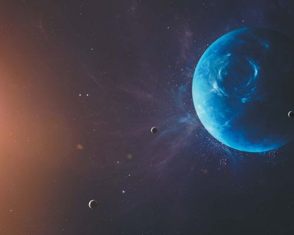

# Нептун
*Нептун* — первая планета, которая была обнаружена не благодаря 
наблюдениям, а с помощью математических расчетов. Произошло это событие 
23 сентября 1846 года.

*Нептун* — восьмая и самая дальняя планета в нашей Солнечной системе. 
Она представляет собой шар из газа и льда с каменистым ядром внутри. 
Как Юпитер, Сатурн и Уран, Нептун также является планетой без 
поверхности, а потому на нее невозможно сесть космическому кораблю или 
ступить ноге человека.

Что касается температуры на поверхности Нептуна, то здесь она может 
опускаться до -218 градусов. Средняя же температура -200 градусов. 
Уникальность Нептуна в том, что там дуют самые сильные ветры во всей 
Солнечной системе. Их скорость может достигать почти 1930 километров в 
час!

